<p align="center">
  <picture>
    <source media="(prefers-color-scheme: dark)" srcset="landing/static/logo-text-light.svg">
    
  </picture>
</p>

# Passing Circle

> [!WARNING]
> This project is under active development and is not yet ready for use. 
> This project is being built by [@swherdman](https://github.com/swherdman).

Temporary, privacy-focused chat for events. Self-hosted Docker stack with passkey-only authentication — no passwords, no accounts to manage, no (hopefully) support overhead.

## How It Works

Passing Circle runs a full Matrix chat stack behind a single reverse proxy. The user flow is kept as simple and transparent as possible. The solution leverages passkeys instead of passwords. Usernames are auto-generated (e.g. `swift-fox-7291`) but users can set their own. All user data can be wiped between events while preserving configuration.

> **Note:** Private rooms and direct messages are encrypted end-to-end by default (enforced by Synapse). Public rooms (general, announcements) are unencrypted so that late joiners can see full message history.

<p align="center">
  <video src="docs/demos/passing-circle-demo.mp4" width="600" controls></video>
</p>

## Architecture

<p align="center">
  <picture>
    <source media="(prefers-color-scheme: dark)" srcset="docs/architecture/infrastructure-diagram-dark.svg">
    
  </picture>
</p>

8 containers, 3 DNS entries, zero external dependencies beyond Docker.

| Container | Purpose |
|-----------|---------|
| nginx | Reverse proxy + TLS termination |
| synapse | Matrix homeserver |
| synapse-db | Synapse PostgreSQL |
| fluffychat | Matrix web client ([custom fork](https://github.com/swherdman/fluffychat) with auto-SSO) |
| element | Matrix web client (optional, disabled by default) |
| authentik-server | Identity provider (OIDC + passkeys) |
| authentik-worker | Authentik background tasks |
| authentik-db | Authentik PostgreSQL |

```
chat.example.com/                → Landing page
chat.example.com/_matrix/*       → Synapse API
chat-auth.example.com/*          → Authentik IdP
chat-mobile.example.com/*        → FluffyChat client (auto-SSO redirect)
```

## Quick Start

### Prerequisites

- Docker and Docker Compose
- A domain with valid TLS certificates (passkeys/WebAuthn require HTTPS from a trusted CA — self-signed certs will not work for authentication)
- DNS entries for your three subdomains (chat, auth, mobile client)

> **Note:** There is no turnkey solution for TLS/domain provisioning yet. You need to bring your own domain and certificates. During development, a [Cloudflare Tunnel](docs/setup/cloudflare-tunnel.md) can be used as a workaround.

### Setup

1. **Configure** — edit `config/passingcircle.yml` with your event name, domains, host IP, and room list.

2. **Generate** — run setup to generate secrets, TLS certs, and all service configs:
   ```bash
   ./scripts/setup.sh
   ```

3. **Start** — bring up the stack:
   ```bash
   docker compose up -d
   ```

4. **Initialize rooms** — register the admin user and configure room permissions:
   ```bash
   ./scripts/init-rooms.sh
   ```

5. **Open** your configured domain — the landing page will offer the FluffyChat client.

## Configuration

All settings live in `config/passingcircle.yml`:

```yaml
event:
  name: "My Event 2026"
  tagline: "Connect. Collaborate."

network:
  domain: "chat.example.com"
  auth_domain: "chat-auth.example.com"
  fluffychat_domain: "chat-mobile.example.com"
  host_ip: "192.168.1.100"

rooms:
  - id: "general"
    name: "General"
    topic: "Open discussion"
    auto_join: true
    announce_only: false
  - id: "announcements"
    name: "Announcements"
    topic: "Official announcements"
    auto_join: true
    announce_only: true

admins:
  - username: "eventadmin"
```

Secrets are auto-generated on first run and saved back to the config file.

## Event Reset

Wipe all user data between events while keeping your configuration:

```bash
./scripts/reset.sh
```

This removes all databases, media, and session data. Config, certificates, and signing keys are preserved. Run `docker compose up -d` and `./scripts/init-rooms.sh` to start fresh.

## Project Structure

```
config/passingcircle.yml          # Single source of truth
scripts/
  setup.sh                        # Generates everything from config
  init-rooms.sh                   # Post-startup room configuration
  reset.sh                        # Wipe user data between events
  create-test-user.sh             # Register a test user
services/
  nginx/templates/                # NGINX reverse proxy configs
  synapse/templates/              # Matrix homeserver config
  fluffychat/templates/           # FluffyChat client config
  authentik/templates/            # Authentik IdP blueprints
landing/templates/                # Landing page
docs/                             # Detailed documentation
```

Templates are Jinja2 files rendered by `scripts/generate.py` during setup. Generated output (configs, certs, `.env`) is gitignored.

See [docs/README.md](docs/README.md) for detailed architecture, setup, and operations documentation.

## License

MIT
